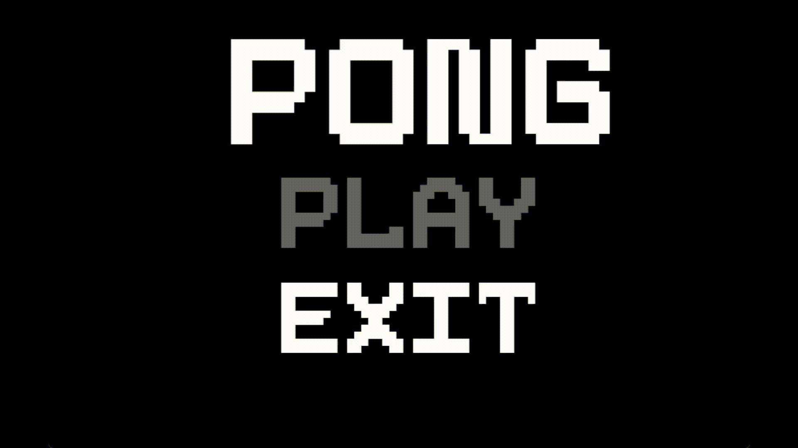

# PongPongGl

## Overview

C++ Project targeted to enhance skills of OpenGL + SDL2.
PongPongGl is a modern take on the classic Pong game, developed using OpenGL for graphics rendering and SDL2 (Simple DirectMedia Layer) for window management, input handling, and audio playback. This project aims to provide an experience for developers interested in game development using OpenGL and SDL2, showcasing the integration of these technologies to create a simple yet engaging game.

## Features

- Classic Pong Gameplay: Two-player mode where each player controls a paddle to hit the ball back and forth.
- Graphics Rendering with OpenGL: Utilizes OpenGL for rendering the game elements, providing smooth and scalable graphics.
- Cross-Platform Compatibility: Runs on Windows, macOS, and Linux, leveraging SDL2's cross-platform capabilities.
- Keyboard Input Handling: Player controls using the keyboard (e.g., W/S keys for Player 1 and Up/Down arrow keys for Player 2).
- Audio Feedback: Simple sound effects for ball collisions and scoring using SDL2's audio capabilities.
- Score Tracking: Displays scores for both players, with the game resetting when a player reaches a predefined score limit.

## Future Enhancements

- AI Opponent: Implement an AI-controlled paddle for single-player mode.
- Networking: Enable multiplayer over a network.
- Customizable Settings: Allow players to customize controls, game speed, and difficulty.

## Contributing

Contributions are welcome! Please fork the repository and submit a pull request with your improvements or bug fixes. For major changes, please open an issue first to discuss what you would like to change.
